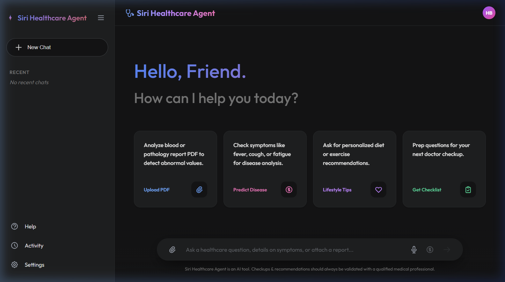
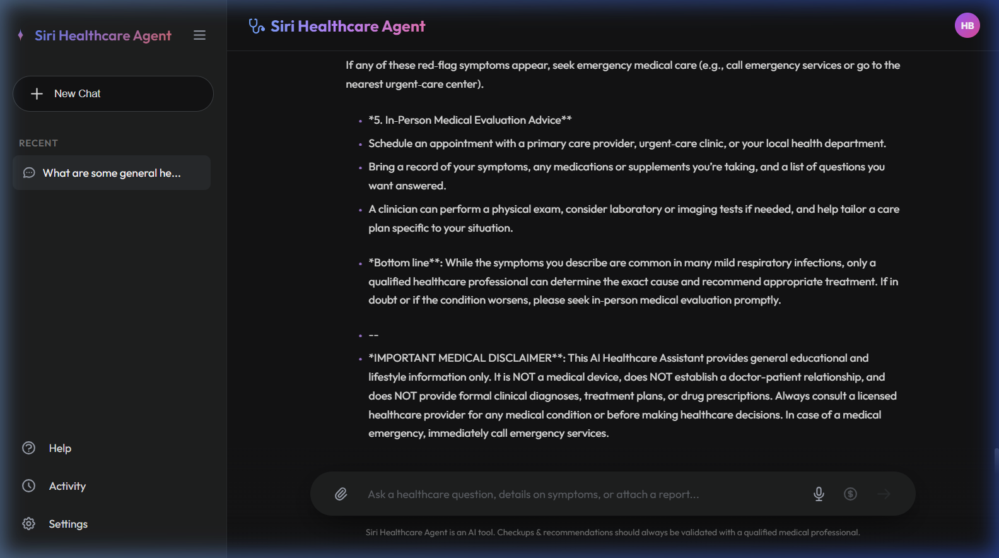
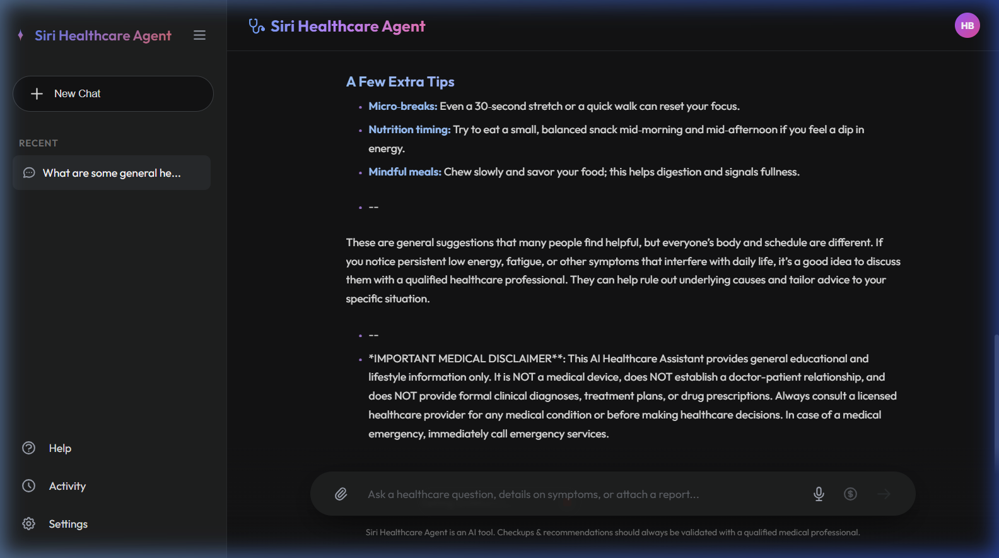
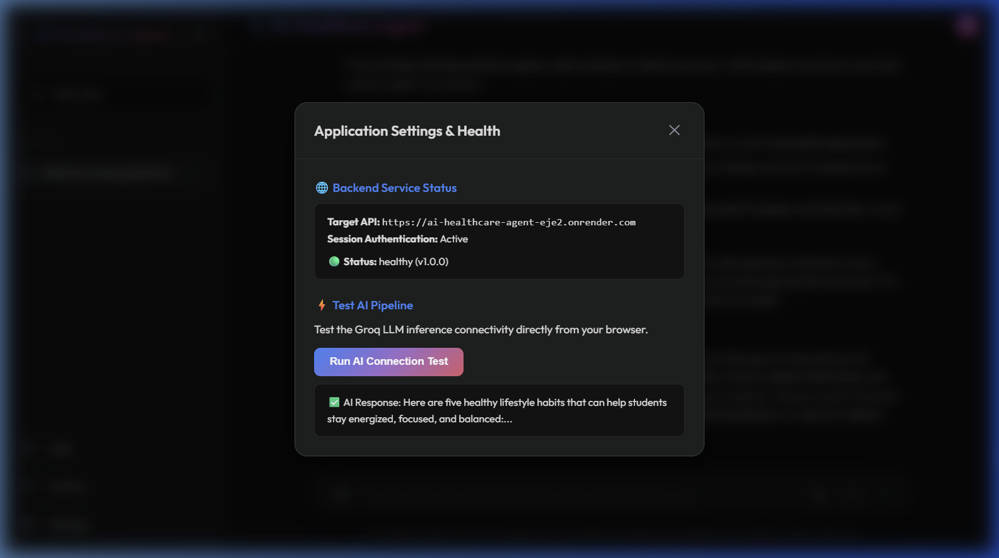
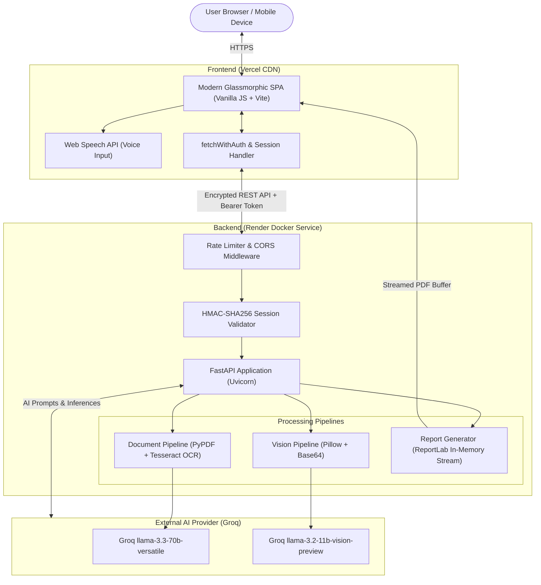

# 🩺 Siri Healthcare Agent

[](https://github.com/Srikanthbanoth7533/AI-Healthcare-Agent/actions/workflows/ci.yml)
[](https://siri-healthcare-agent.vercel.app)
[](https://ai-healthcare-agent-eje2.onrender.com/health)
[](https://www.python.org/)
[](https://fastapi.tiangolo.com)
[](LICENSE)

An intelligent, privacy-first AI Healthcare Assistant powered by **FastAPI**, **Groq LLMs (Llama 3.3 70B & Llama 3.2 11B Vision)**, **Tesseract OCR**, **PyPDF**, and a modern glassmorphic web interface.

Siri Healthcare Agent delivers instant educational health guidance, symptom triage assessments, medical report parsing, visual dermatology evaluations, and downloadable clinical summary reports — engineered with strict healthcare safety boundaries, prompt-injection defenses, and session security.

---

## 🌐 Live Deployments

- **Production Web Application:** [https://siri-healthcare-agent.vercel.app](https://siri-healthcare-agent.vercel.app)
- **Backend API Service:** [https://ai-healthcare-agent-eje2.onrender.com](https://ai-healthcare-agent-eje2.onrender.com)
- **API Health Check:** [https://ai-healthcare-agent-eje2.onrender.com/health](https://ai-healthcare-agent-eje2.onrender.com/health)

---

## 📸 Screenshots & Interface

| Interactive Chat & Starter Prompts | Symptom Risk Assessment |
|---|---|
|  |  |

| Health Consultation Feed | Settings & AI Connectivity Diagnostic |
|---|---|
|  |  |

---

## 🌟 Key Features

### 1. 🤖 AI Healthcare Consultation
- Conversational healthcare queries powered by Groq's high-speed `llama-3.3-70b-versatile` model.
- Streaming responses with clean Markdown rendering and health-specific starter prompt suggestions.

### 2. 🔍 Symptom Analysis & Risk Assessment
- Evaluates described symptoms to outline potential educational conditions, self-care measures, and clinical questions for physicians.
- Automatically flags red-flag symptoms requiring emergency intervention.

### 3. 📄 Pathology & Medical Document Extraction
- Supports multi-page laboratory and clinical PDF uploads (up to 10MB).
- Dual extraction pipeline: high-speed digital text parsing via `pypdf`, falling back to OCR scanning via `pdf2image` and `pytesseract` for scanned records.

### 4. 👁️ Visual Clinical Analysis (Vision LLM)
- Analyzes wound, skin, and diagnostic imagery with Groq's multimodal `llama-3.2-11b-vision-preview`.
- Identifies visual features, first-aid precautions, and red-flag symptoms of infection.

### 5. 📑 In-Memory PDF Report Generation
- Generates downloadable clinical PDF summaries using `reportlab`.
- **Zero Shared Disk Storage:** PDFs are built and streamed directly from ephemeral memory buffers (`io.BytesIO`), guaranteeing total privacy and isolation between users.

### 6. 🎙️ Hands-Free Voice Input
- Real-time speech-to-text integration using the native browser Web Speech API.
- Live microphone pulsation states, visual feedback, and graceful fallback handling.

### 7. 📱 Modern Responsive Experience
- Clean, glassmorphic dark-mode design built with vanilla CSS tokens and Outfit typography.
- Collapsible desktop sidebar and an off-canvas slide-out drawer with backdrop for mobile screens.
- Interactive modal dialogs for **Help & Emergency Contacts**, **Session Activity & Metrics**, and **System Settings**.

---

## 🛡️ Security, Safety & Privacy Controls

| Security Domain | Implementation Details |
|---|---|
| **Authentication** | Signed HMAC-SHA256 ephemeral session tokens with 2-hour session expiration via `POST /auth/session`, plus `X-API-Key` header support for programmatic consumers. |
| **CORS Restriction** | Strict domain allowlist (`ALLOWED_ORIGINS`). Public wildcard (`*`) access is explicitly blocked. |
| **Upload Security** | Pre-flight client checks + 10MB chunked backend stream enforcement (`HTTP 413`). Mandatory magic-byte signature validation (`%PDF-`, JPEG, PNG, WEBP). Sanitized UUID filenames inside auto-purging temporary directories. |
| **Rate Limiting** | Custom sliding-window rate limiter per client IP with `HTTP 429` enforcement and `Retry-After` headers. |
| **Prompt-Injection Defense** | All user inputs are encapsulated within structural `<untrusted_user_message>` boundary blocks, with system prompt rules prohibiting overrides, drug prescribing, or disclaimer omissions. |
| **Healthcare Guardrails** | Strict prohibition on clinical drug prescriptions and definitive diagnostic claims. Mandatory medical disclaimers appended to every AI output. |
| **Session Isolation** | Fully stateless request lifecycle with zero global mutable state across user sessions. |

---

## 🏗️ System Architecture



---

## 📡 API Reference

All protected endpoints require either an ephemeral session token (`Authorization: Bearer <token>`) or a valid API key (`X-API-Key: <key>`).

| Method | Endpoint | Auth Required | Description |
|---|---|:---:|---|
| `GET` | `/` | No | Root endpoint (Serves SPA to browsers, JSON to API clients). |
| `GET` | `/health` | No | Service liveness and health status. |
| `POST` | `/auth/session` | No | Generates a signed HMAC-SHA256 session token (2-hour expiration). |
| `POST` | `/chat` | **Yes** | General healthcare assistant chat inquiry. |
| `POST` | `/predict-disease` | **Yes** | Structured symptom evaluation and triage risk guidance. |
| `POST` | `/analyze-report/` | **Yes** | Extracts and analyzes laboratory or clinical PDF reports via text extraction/OCR. |
| `POST` | `/predict-image` | **Yes** | Multimodal visual assessment of skin, wounds, or reports. |
| `POST` | `/generate-pdf/` | **Yes** | Generates an isolated PDF report in memory for download. |
| `GET` | `/ai-test` | **Yes** | Diagnostics probe verifying live Groq LLM connectivity. |

---

## 💻 Local Development Setup

### Prerequisites
- **Python 3.11+**
- **Node.js 20+** and `npm`
- **Tesseract OCR** and **Poppler utilities** (for PDF image/OCR processing)
  - *Ubuntu/Debian:* `sudo apt-get install -y tesseract-ocr poppler-utils`
  - *macOS:* `brew install tesseract poppler`
  - *Windows:* Install via Chocolatey or official binaries and add to system `PATH`.

### 1. Clone the Repository
```bash
git clone https://github.com/Srikanthbanoth7533/AI-Healthcare-Agent.git
cd AI-Healthcare-Agent
```

### 2. Backend Setup
```bash
# Navigate to backend directory
cd backend

# Create and activate virtual environment
python -m venv venv
# On Windows:
.\venv\Scripts\activate
# On Linux/macOS:
source venv/bin/activate

# Install dependencies
pip install -r requirements.txt
pip install ruff pytest

# Configure environment variables
cp .env.example .env  # or create .env with your keys
```

#### Sample `.env` Configuration:
```env
GROQ_API_KEY="your-groq-api-key-here"
APP_SECRET_KEY="replace-with-a-random-secret-key-for-session-tokens"
APP_API_KEY="" # Optional static API key for programmatic access
ALLOWED_ORIGINS="http://localhost:5173,http://127.0.0.1:5173,http://127.0.0.1:8000"
GROQ_MODEL="llama-3.3-70b-versatile" # Optional model override
GROQ_VISION_MODEL="llama-3.2-11b-vision-preview" # Optional vision model override
PORT=8000
```

#### Run Backend Server:
```bash
uvicorn app:app --reload --host 127.0.0.1 --port 8000
```

### 3. Frontend Setup
```bash
# In another terminal, from the project root:
cd frontend

# Install dependencies
npm install

# Start Vite dev server
npm run dev
```

Visit `http://localhost:5173` in your browser.

---

## 🧪 Testing & Quality Assurance

The repository currently contains 38 automated tests covering authentication, session lifecycles, input bounds, security edge cases, file signatures, and prompt injection attempts.

```bash
# Run backend test suite
cd backend
python -m pytest tests/ -v

# Run backend linter (Ruff)
python -m ruff check app.py tests/

# Run frontend linter (ESLint)
cd ../frontend
npm run lint

# Run production build validation
npm run build
```

---

## 🚢 Deployment Configuration

### Vercel (Frontend SPA)
The project includes a root [`vercel.json`](vercel.json) and unified cross-platform build script [`scripts/build.js`](scripts/build.js) that packages the Vite distribution to `dist/` and mirrors it cleanly for Vercel's Edge CDN.

### Render (Dockerized Backend)
The backend is packaged using a multi-stage [`backend/Dockerfile`](backend/Dockerfile) containing Debian system libraries (`tesseract-ocr`, `poppler-utils`, `libgl1-mesa-glx`), exposing dynamic `$PORT` handling for Render Web Services.

---

## ⚠️ Medical Disclaimer

> **CRITICAL MEDICAL NOTICE:**  
> Siri Healthcare Agent is an artificial intelligence application designed solely for **educational, triage, and informational purposes**. It is **NOT** a certified medical device and does **NOT** provide definitive clinical diagnoses, patient-specific medical prescriptions, or medical treatment plans.
>
> Always consult a qualified physician or healthcare professional for any medical concerns. In an acute medical emergency, contact your local emergency service (e.g., **911** in the US, **999** in the UK, **112** in the EU/India) immediately.

---

## 📄 License

This project is licensed under the MIT License — see the [LICENSE](LICENSE) file for details.
